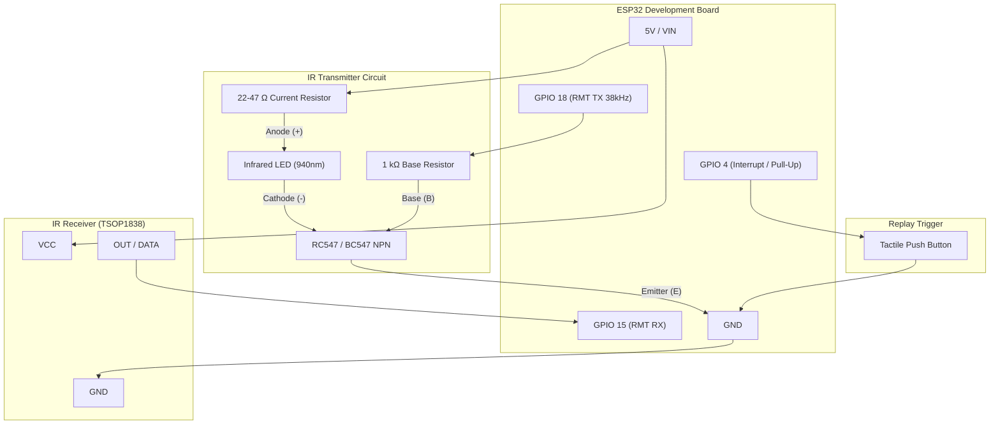

# ESP32 Universal IR Remote Cloner & Replayer

An ESP-IDF (PlatformIO) project for the ESP32 that records any 38 kHz infrared remote control signal (TV, AC, audio, etc.) using a TSOP receiver, stores the raw pulse symbols in memory, and replays them on command via a tactile push button using a high-output IR LED driven by an **RC547 / BC547 NPN transistor**.

Built on modern **ESP-IDF v5 RMT (Remote Control Peripheral)** driver APIs with low-overhead FreeRTOS task notifications and interrupt-driven debounce handling.

---

## Features

- **Protocol Agnostic / Raw Symbol Capture**: Captures arbitrary IR protocols (NEC, RC5, RC6, Sony SIRC, Samsung, etc.) by recording raw pulse-width symbol durations without needing protocol-specific decoders.
- **Hardware-Modulated 38 kHz Carrier**: Employs ESP32's onboard RMT hardware carrier generator (38 kHz, 33% duty cycle) for clean, timing-accurate IR burst transmissions.
- **Transistor-Driven High-Range Transmitter**: Leverages an **RC547 / BC547 NPN** transistor in a low-side driver configuration to supply peak pulse currents (~50–150 mA) beyond the safe limit of an ESP32 GPIO pin (~12–20 mA).
- **TSOP Active-LOW Inversion Handling**: Automatically handles the active-LOW output characteristic of TSOP demodulators by inverting recorded symbol levels prior to transmission.
- **Zero-CPU Wait State**: The push button uses hardware interrupts (`GPIO_INTR_NEGEDGE`) with FreeRTOS direct task notifications (`ulTaskNotifyTake`), keeping the CPU in an idle state until triggered.
- **Hardware Glitch Filtering & Frame Timeout**: Built-in 1.25 µs noise filtering and 12 ms frame-end detection.

---

## Hardware Requirements

| Component | Quantity | Purpose / Specification |
| :--- | :---: | :--- |
| **ESP32 DevKit** | 1 | 30-pin or 38-pin ESP32 development board (ESP-WROOM-32) |
| **IR Receiver** | 1 | TSOP38238, TSOP4838, or 1838 (38 kHz demodulated IR receiver) |
| **IR Transmitter LED** | 1 | 940 nm (standard) or 850 nm Infrared LED |
| **NPN Transistor** | 1 | **RC547 / BC547** (TO-92 package, NPN BJT) |
| **Base Resistor** | 1 | $1\text{ k}\Omega$ (limits base current from GPIO 18) |
| **Current Limiting Resistor** | 1 | $22\Omega - 47\Omega$ (for 5V supply) or $10\Omega - 22\Omega$ (for 3.3V supply) |
| **Pushbutton** | 1 | Momentary tactile switch (Normally Open) |
| **Jumper Wires & Breadboard**| - | Prototype connections |

---

## Pin Assignment

| ESP32 Pin | Direction | Connected Device | Notes |
| :--- | :---: | :--- | :--- |
| **GPIO 15** | Input | **TSOP Receiver DATA (OUT)** | Internal RMT RX peripheral channel |
| **GPIO 18** | Output | **RC547 / BC547 Base** (via $1\text{ k}\Omega$ resistor) | RMT TX channel modulated at 38 kHz |
| **GPIO 4** | Input | **Tactile Pushbutton** | Internal pull-up enabled; switch shorts to GND |
| **5V / VIN** | Power | IR LED Anode (via current resistor) & TSOP VCC | Provides stronger IR burst range |
| **GND** | Ground | Common Ground | Connected to ESP32, TSOP, Transistor Emitter, Button |

---

## Circuit Schematic & Wiring

### Transistor Driver Overview
An ESP32 GPIO pin cannot safely supply the current required for long-range IR transmission (typically $\ge 80\text{ mA}$). The **RC547 / BC547 NPN transistor** acts as a saturated low-side switch:
- When **GPIO 18** outputs HIGH (modulated with 38 kHz pulses), current flows through the base resistor into the Base, turning ON the transistor.
- The Collector pulls the Cathode of the IR LED to Ground, lighting up the IR LED with full supply current.
- When **GPIO 18** is LOW, the transistor is in cutoff mode, and the IR LED is completely off.

### ASCII Schematic

```text
                +5V (or 3.3V)
                     |
                     +-----------------------------+
                     |                             |
                    [ ] Current Resistor           | (VCC)
                    [ ] (22 - 47 Ohm)          +---+---+
                     |                         |  TSOP |
                  +--+--+                      | 1838  |
                  |     | Anode (+)            |       |
                  | IR  |                      +-+-+-+-+
                  | LED |                        | | |
                  |     | Cathode (-)            | | +-- DATA ---> ESP32 GPIO 15
                  +--+--+                        | +---- GND  ---> GND
                     |                           +------ VCC  ---> 5V / 3.3V
                     |
                 (Collector)
                 [C]
        1k     +-+ |
GPIO 18 -[===]-|B  |  RC547 / BC547 (NPN)
        Resistor +-+ |
                 [E]
                 (Emitter)
                     |
                    GND

========================================================================

ESP32 GPIO 4 ---+
                |
               ---  Tactile Push Button
              o   o (Normally Open)
                |
               GND (Internal Pull-Up enabled on GPIO 4)
```

### Transistor Pinout (RC547 / BC547, TO-92 Flat Face Forward)

```text
   +---------+
   |  RC547  |     1: Collector (C) -> Connected to IR LED Cathode
   |  BC547  |     2: Base (B)      -> Connected to GPIO 18 through 1k resistor
   +---------+     3: Emitter (E)   -> Connected to GND
     |  |  |
     1  2  3
     C  B  E
```

### Connection Flowchart



---

## Theory of Operation & Code Breakdown

The core logic resides in [`src/main.c`](file:///c:/Users/gaura/DIY/IR_Control/src/main.c):

### 1. Reception (RMT RX)
- **Driver Setup**: Configures an RMT RX channel on `GPIO 15` with a $1\text{ }\mu\text{s}$ tick resolution.
- **Glitch Filter**: Rejects spikes shorter than $1.25\text{ }\mu\text{s}$ (`signal_range_min_ns = 1250`).
- **End-of-Frame Timeout**: Waits $12\text{ ms}$ (`signal_range_max_ns = 12000000`) of continuous idle time before concluding that the transmission burst has finished.
- **ISR & Queue**: The `rmt_rx_done_callback` ISR packs received symbols into an `ir_rx_data_t` structure and dispatches it over `rx_queue` to `app_main`.

### 2. Signal Inversion for Replay
- TSOP modules are **active-LOW** (they output a LOW logic level when detecting a 38 kHz infrared carrier burst and pull HIGH when idle).
- The ESP32 RMT carrier modulator generates the 38 kHz wave when the symbol logic level is **HIGH**.
- To transmit the exact pulses originally emitted by the remote, the stored levels are inverted before feeding them into `rmt_transmit()`:
  ```c
  for (size_t i = 0; i < stored_signal.num_symbols; i++) {
      tx_symbols[i].level0 = !tx_symbols[i].level0;
      tx_symbols[i].level1 = !tx_symbols[i].level1;
  }
  ```

### 3. Carrier Modulation (38 kHz)
- Configured using `rmt_apply_carrier()`:
  - Frequency: `38000 Hz`
  - Duty Cycle: `0.33` (33% duty ratio matches industry standard for remote transmitters, extending battery/component life and peak intensity)
  - `polarity_active_low = false`: Matches the low-side NPN driver switch topology.

### 4. Pushbutton & Debounce Handling
- Configured as an input with internal pull-up (`GPIO_PULLUP_ENABLE`) and negative-edge interrupt (`GPIO_INTR_NEGEDGE`).
- The ISR (`button_isr_handler`) disables the pin interrupt and notifies `button_task` via FreeRTOS `vTaskNotifyGiveFromISR()`.
- `button_task` wakes up, waits $50\text{ ms}$ debounce time, verifies the pin is still pressed, re-transmits the stored signal, waits for release, and re-enables the interrupt.

---

## Project Structure

```text
IR_Control/
├── .vscode/               # VS Code workspace settings & IntelliSense
├── include/               # Public C/C++ header files
├── lib/                   # Component / Project libraries
├── src/
│   ├── CMakeLists.txt     # ESP-IDF component build configuration
│   └── main.c             # Main application logic (RMT RX/TX & Button task)
├── test/                  # Unit test directory
├── platformio.ini         # PlatformIO project configuration
└── README.md              # Project documentation
```

---

## Building and Flashing

### Prerequisites
- [PlatformIO Core (CLI)](https://platformio.org/install/cli) or [PlatformIO IDE for VS Code](https://platformio.org/install/ide).
- USB cable connected from PC to the ESP32 board.

### Build and Upload via PlatformIO CLI

1. **Build the project:**
   ```bash
   pio run
   ```

2. **Upload firmware to the ESP32:**
   ```bash
   pio run -t upload
   ```

3. **Open the serial monitor (115200 baud):**
   ```bash
   pio device monitor -b 115200
   ```

---

## Usage Guide

1. **Power On**: Flash the code and open the serial monitor. You should see:
   ```text
   I (xxx) IR_LEARN: System Ready!
   I (xxx) IR_LEARN:  -> Press any TV remote button to store signal into slot
   I (xxx) IR_LEARN:  -> Press GPIO 4 push button to replay stored signal
   ```
2. **Learn an IR Command**:
   - Point your target remote control (e.g., TV or air conditioner remote) directly at the TSOP receiver (2–5 cm away).
   - Press the desired button once.
   - The serial console will print the captured pulse count along with the raw symbol durations.
3. **Replay the Command**:
   - Aim the circuit's IR LED at your target appliance.
   - Press the push button connected to **GPIO 4**.
   - The ESP32 will output the 38 kHz modulated IR command. The appliance will react as if the original remote button was pressed.

---

## Troubleshooting & Tips

- **Range is too short?**
  - Ensure the IR LED anode is connected to **5V (VIN)** rather than 3.3V.
  - Lower the current limiting resistor on the IR LED (down to $15\Omega - 22\Omega$). Because the IR LED is pulsed at 38 kHz at a 33% duty cycle, high peak currents are safe for short bursts.
  - Ensure the Base resistor is between $470\Omega$ and $1\text{ k}\Omega$ so the transistor operates in full saturation.
- **Remote signal not captured?**
  - Verify that the TSOP receiver pinout matches your exact module (some modules have `GND - VCC - OUT`, while others have `OUT - GND - VCC`).
  - Some air conditioner remotes send very long frames (> 128 symbols). You can increase `MAX_IR_SYMBOLS` in [`src/main.c`](file:///c:/Users/gaura/DIY/IR_Control/src/main.c) (e.g., to 256 or 512).
- **Spurious button triggers?**
  - Check the tactile switch wiring and increase `DEBOUNCE_TIME_MS` if mechanical bouncing occurs.
