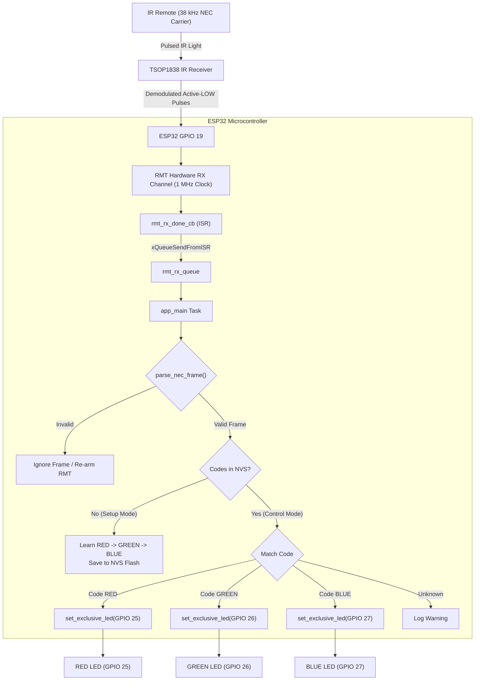
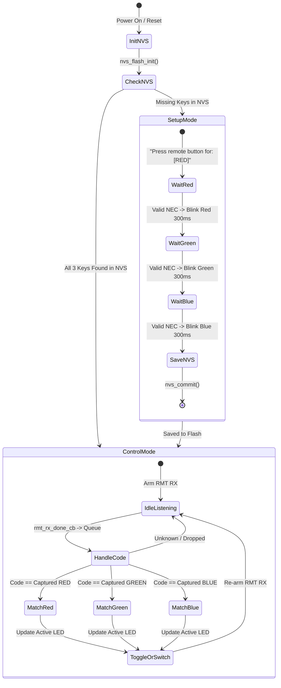

# ESP32 IR Remote Controller for RGB LEDs

An ESP-IDF (v5.x) based smart infrared receiver and LED controller running on an ESP32. The system dynamically learns any standard NEC-compatible infrared remote control buttons for **Red**, **Green**, and **Blue** channels, stores the captured button codes in **Non-Volatile Storage (NVS flash)**, and provides mutual-exclusive LED control with toggle-off capabilities. It also outputs decoded signals as **Pronto Hex strings** for integration with universal remotes and home automation systems.

---

## Table of Contents

- [Overview & Key Features](#overview--key-features)
- [Hardware & Circuit Diagram](#hardware--circuit-diagram)
  - [Bill of Materials (BOM)](#bill-of-materials-bom)
  - [Pin Assignment Table](#pin-assignment-table)
  - [ASCII Wiring Schematic](#ascii-wiring-schematic)
  - [Component Flowchart](#component-flowchart)
- [How It Works](#how-it-works)
  - [Operating Modes](#operating-modes)
  - [LED Switching & Toggle Logic](#led-switching--toggle-logic)
  - [NEC Protocol Frame Anatomy](#nec-protocol-frame-anatomy)
  - [Pronto Hex Export](#pronto-hex-export)
- [Project Structure](#project-structure)
- [Setup & Flashing](#setup--flashing)
  - [Prerequisites](#prerequisites)
  - [Build and Flash using PlatformIO](#build-and-flash-using-platformio)
  - [Interactive Setup Walkthrough](#interactive-setup-walkthrough)
- [Code & Hardware Gotchas](#code--hardware-gotchas)
  - [1. Hardware & Electrical Gotchas](#1-hardware--electrical-gotchas)
  - [2. Protocol & Remote Control Gotchas](#2-protocol--remote-control-gotchas)
  - [3. ESP-IDF & Driver Gotchas](#3-esp-idf--driver-gotchas)
  - [4. Storage & Factory Reset Gotchas](#4-storage--factory-reset-gotchas)
- [Troubleshooting Checklist](#troubleshooting-checklist)

---

## Overview & Key Features

- **Interactive Learning Mode**: On first boot (or when NVS is blank), sequentially guides the user via serial logs to map physical remote buttons to RED, GREEN, and BLUE LEDs.
- **Visual Learning Feedback**: Blinks each respective LED for 300 ms upon successfully registering its remote button.
- **Persistent Memory (NVS)**: Remote codes are retained across power cycles and reboots via the ESP32 NVS flash subsystem.
- **Mutual Exclusive Switching & Toggle-Off**: Only one color is active at a time; pressing the active color's button again toggles the LED OFF.
- **Modern ESP-IDF v5 RMT Peripheral**: Employs hardware Remote Control (RMT) RX driver with hardware glitch filtering and ISR-to-queue event notification.
- **Pronto Hex Generator**: Automatically calculates and prints universal Pronto Hex codes to the serial monitor.

---

## Hardware & Circuit Diagram

### Bill of Materials (BOM)

| Item | Quantity | Description / Value |
|---|---|---|
| **ESP32 Dev Board** | 1 | NodeMCU ESP-32S / ESP32-WROOM-32 (30 or 38 pin) |
| **IR Receiver** | 1 | TSOP1838 / VS1838B / HS0038 (38 kHz IR receiver module) |
| **LEDs** | 3 (or 1 RGB) | Standard Red, Green, Blue LEDs or Common-Cathode RGB LED |
| **Current Limiting Resistors**| 3 | $220\,\Omega\text{ to }330\,\Omega$ ($\frac{1}{4}\text{W}$) for LEDs |
| **Remote Control** | 1 | Any IR remote using standard NEC protocol (TV, DVD, audio, Arduino kit remote) |
| **Breadboard & Wires** | — | Standard breadboard and male-to-male / male-to-female jumper wires |

---

### Pin Assignment Table

| Function | ESP32 GPIO | Connected Component Pin | Notes |
|---|---|---|---|
| **IR Receiver** | `GPIO 19` | TSOP1838 **OUT** (Data) | Driven by ESP32 hardware RMT RX |
| **Red LED** | `GPIO 25` | Red Anode (+) via $220\,\Omega$ resistor | Active HIGH output |
| **Green LED** | `GPIO 26` | Green Anode (+) via $220\,\Omega$ resistor | Active HIGH output |
| **Blue LED** | `GPIO 27` | Blue Anode (+) via $220\,\Omega$ resistor | Active HIGH output |
| **Power (VCC)** | `3.3V` / `VIN (5V)` | TSOP1838 **VCC** | **3.3V is strongly recommended** (see gotchas) |
| **Ground (GND)** | `GND` | TSOP1838 **GND**, LED Cathodes (-) | Common reference ground |

---

### ASCII Wiring Schematic

```text
               +---------------------------------------+
               |             ESP32 DevKit              |
               |                                       |
               |  [3.3V] --------+                     |
               |                 |                     |
               |  [GND] ---------+-------------+       |
               |                 |             |       |
               |  [GPIO 19] -----+----+        |       |
               |                 |    |        |       |
               |  [GPIO 25] --+  |    |        |       |
               |  [GPIO 26] --|--+    |        |       |
               |  [GPIO 27] --|--|----+        |       |
               +--------------|--|--|----------|-------+
                              |  |  |          |
                              |  |  |          |
         +--------------------+  |  |          |
         |                       |  |          |
         |   220-330 Ohm         |  |          |
 [GPIO 25] --[=====]--->|-(A) RED LED (K)------+
         |                                     |
         |   220-330 Ohm                       |
 [GPIO 26] --[=====]--->|-(A) GREEN LED (K)----+
         |                                     |
         |   220-330 Ohm                       |
 [GPIO 27] --[=====]--->|-(A) BLUE LED (K)-----+
                                               |
                                               |
             +-------------------+             |
             |  TSOP1838 Sensor  |             |
             |   +-----------+   |             |
             |   |  (Front)  |   |             |
             |   | [ [ ] ]   |   |             |
             |   +-----------+   |             |
             |     1   2   3     |             |
             |    OUT GND VCC    |             |
             +-----|---|---|-----+             |
                   |   |   |                   |
 [GPIO 19] <-------+   |   +---------> [3.3V]  |
                       |                       |
 [Common GND] <--------+-----------------------+
```

> [!CAUTION]
> **Check your TSOP pinout carefully!** Bare TSOP1838 packages (metal mesh face) typically have pinout `1: OUT, 2: GND, 3: VCC`. However, **breakout boards on small PCBs** often rearrange the pins (`OUT, VCC, GND` or `-, +, S`). Swapping VCC and GND will destroy or permanently degrade the sensor!

---

### Component Flowchart



---

## How It Works

### Operating Modes



### LED Switching & Toggle Logic

The function `set_exclusive_led(target_pin)` enforces three simple rules:
1. **Toggle OFF**: If the requested button matches `current_active_led`, all LEDs are turned off and `current_active_led` becomes `GPIO_NUM_NC`.
2. **Mutual Exclusion**: If switching to a different LED, all other LEDs are extinguished first before lighting the target pin.
3. **Clean State**: At startup, `set_exclusive_led(GPIO_NUM_NC)` guarantees all LEDs start in the OFF state.

---

### NEC Protocol Frame Anatomy

The decoder in [`src/main.c`](file:///c:/Users/gaura/DIY/IR_Remote_For_LED/src/main.c) validates standard 32-bit NEC infrared messages:

```text
+----------------------+--------------------+--------------------+--------------------+
|  Leader Pulse        |  Address (8-bit)   |  ~Address (8-bit)  |  Command (8-bit)   |  ~Command (8-bit)  |
|  9ms Mark + 4.5ms Sp |  LSB First         |  (or Extended Addr)|  LSB First         |  Inverted Command  |
+----------------------+--------------------+--------------------+--------------------+
| <--- 1 symbol -----> | <---- 8 symbols -> | <---- 8 symbols -> | <---- 8 symbols -> | <---- 8 symbols -> |
Total: >= 33 symbols (1 leading burst + 32 pulse-distance data bits)
```

- **Leading Burst**: $9000\,\mu\text{s}$ LOW (carrier active) followed by $4500\,\mu\text{s}$ HIGH (carrier idle).
- **Bit Representation (Pulse Distance)**:
  - **Bit '0'**: $560\,\mu\text{s}$ mark + $560\,\mu\text{s}$ space.
  - **Bit '1'**: $560\,\mu\text{s}$ mark + $1690\,\mu\text{s}$ space.
- **Checksum Verification**:
  ```c
  uint8_t command     = (raw_data >> 16) & 0xFF;
  uint8_t command_bar = (raw_data >> 24) & 0xFF;
  if ((command ^ command_bar) != 0xFF) return false;
  ```
  The code requires the command byte and its bitwise inverted complement to XOR to `0xFF`. This rejects garbage frames, noise, and non-NEC protocols.

---

### Pronto Hex Export

When each code is captured (or restored from NVS), the system prints a full Pronto Hex string to the serial monitor:
```text
--- Pronto Hex Output ---
0000 006D 0022 0000 0157 00AC 0015 0015 0015 0041 ... 0015 0E6C
-------------------------
```
- `0000`: Learned raw format indicator.
- `006D`: $38\,\text{kHz}$ carrier frequency descriptor ($f = \frac{1000000}{0\text{x}006D \times 0.24124} \approx 38\,\text{kHz}$).
- `0022 0000`: Burst pair count (34 pairs: 1 leader + 32 data + 1 lead-out).
- `0157 00AC`: 9 ms header mark / 4.5 ms header space.
- `0015 0041`: Data bit '1' ($560\,\mu\text{s}$ / $1690\,\mu\text{s}$).
- `0015 0015`: Data bit '0' ($560\,\mu\text{s}$ / $560\,\mu\text{s}$).

These hex strings can be copied directly into **Home Assistant**, **Broadlink**, or universal IR blasters.

---

## Project Structure

```text
IR_Remote_For_LED/
├── .pio/                  # PlatformIO build artifacts and toolchain cache
├── .vscode/               # VS Code workspace settings and IntelliSense
├── include/               # Public headers
├── lib/                   # Project-specific private components/libraries
├── src/
│   ├── CMakeLists.txt     # ESP-IDF component registration
│   └── main.c             # Application source (RMT RX, NVS, NEC decoder, LED logic)
├── test/                  # Unit test runner files
├── CMakeLists.txt         # Root project CMake configuration
├── platformio.ini         # PlatformIO environment, board & framework configuration
├── sdkconfig.esp32dev     # ESP-IDF Kconfig settings
└── README.md              # Project documentation
```

---

## Setup & Flashing

### Prerequisites

1. **Hardware**: ESP32 development board, TSOP1838 receiver, 3x LEDs, 3x $220\,\Omega$ resistors.
2. **Software**:
   - [Visual Studio Code](https://code.visualstudio.com/) with the [PlatformIO IDE Extension](https://platformio.org/install/ide), OR
   - [PlatformIO Core (CLI)](https://platformio.org/install/cli).

### Build and Flash using PlatformIO

1. **Clone or open the workspace:**
   ```bash
   cd c:\Users\gaura\DIY\IR_Remote_For_LED
   ```

2. **Build the firmware:**
   ```bash
   pio run
   ```

3. **Connect the ESP32 via USB and upload:**
   ```bash
   pio run -t upload
   ```

4. **Launch the Serial Monitor (115200 baud):**
   ```bash
   pio device monitor -b 115200
   ```

---

### Interactive Setup Walkthrough

When you first power on the ESP32 with blank NVS:

1. The serial monitor displays:
   ```text
   I (xxx) IR_RGB_CTRL: === Starting IR Remote Setup Mode ===
   I (xxx) IR_RGB_CTRL: Press remote button for: [RED]
   ```
2. Aim your IR remote at the TSOP sensor and press your chosen **RED** button.
   - The serial log confirms the captured 32-bit hex code and displays the Pronto hex string.
   - The **RED LED blinks for 300 ms**.
3. The prompt advances:
   ```text
   I (xxx) IR_RGB_CTRL: Press remote button for: [GREEN]
   ```
   Press your chosen **GREEN** button. The Green LED blinks for 300 ms.
4. The prompt advances:
   ```text
   I (xxx) IR_RGB_CTRL: Press remote button for: [BLUE]
   ```
   Press your chosen **BLUE** button. The Blue LED blinks for 300 ms.
5. All three codes are committed to flash:
   ```text
   I (xxx) IR_RGB_CTRL: Successfully saved all 3 remote codes to NVS!
   I (xxx) IR_RGB_CTRL: === Entering Control Mode ===
   ```
6. Now you are in runtime **Control Mode**. Pressing the learned buttons will exclusively toggle the LEDs.

---

## Code & Hardware Gotchas

### 1. Hardware & Electrical Gotchas

> [!WARNING]
> #### A. TSOP Receiver Operating Voltage & 5V Tolerance
> - TSOP1838 receivers can operate from $2.7\,\text{V}$ to $5.5\,\text{V}$.
> - If you power the TSOP from the **5V / VIN** rail, its internal pull-up resistor pulls the OUT pin to approximately **5V**.
> - **ESP32 GPIO pins are officially rated for 3.3V maximum.** Exposing `GPIO 19` to continuous 5V logic pulses can degrade or destroy the ESP32 pin over time.
> - **Solution**: Power the TSOP directly from the **3.3V rail** of the ESP32. If 5V is mandatory for extended range, insert a voltage divider (e.g., $1\,\text{k}\Omega / 2\,\text{k}\Omega$) or logic-level converter between the TSOP OUT pin and GPIO 19.

> [!CAUTION]
> #### B. TSOP Pinout Reversal (Bare Sensor vs Breakout Module)
> - **Bare 3-pin TSOP1838 (metal dome facing you, pins pointing down):**
>   - Pin 1: **OUT**
>   - Pin 2: **GND**
>   - Pin 3: **VCC**
> - **Common breakout boards (PCB with SMD resistor/LED):**
>   - Frequently labelled `-`, `+`, `S` where `-` = GND, `+` = VCC, `S` = Signal/OUT.
>   - Some clone boards reverse VCC and OUT.
>   - **Gotcha**: Connecting 3.3V to GND and GND to VCC causes the sensor to get burning hot within seconds and will permanently destroy it. Double-check continuity and markings before applying power.

#### C. Direct LED Drive without Resistors
- Each ESP32 GPIO can comfortably supply $12\text{ to }20\,\text{mA}$ (absolute maximum rating $40\,\text{mA}$).
- Connecting LEDs directly between GPIO 25/26/27 and GND without current limiting resistors ($220\,\Omega\text{ to }330\,\Omega$) causes excessive current draw, risking internal pin driver burnout or brownout resets (`ESP_RST_BROWNOUT`).

#### D. Common-Anode vs Common-Cathode RGB LEDs
- The firmware uses **Active-HIGH** logic:
  ```c
  gpio_set_level(target_pin, 1); // Turns ON LED
  gpio_set_level(target_pin, 0); // Turns OFF LED
  ```
- This works directly with discrete LEDs or **Common-Cathode** RGB LEDs (common pin to GND).
- If using a **Common-Anode** RGB LED (common pin connected to +3.3V), the logic is inverted: setting a pin to `1` will turn the color OFF, and setting it to `0` will turn it ON.

#### E. Optical & Electrical Noise on TSOP
- High-frequency fluorescent ballasts, direct sunlight, and poor USB power regulation can cause ghost triggers.
- If erratic symbols are reported in the serial log, place a $100\,\Omega$ resistor in series with the TSOP VCC pin and a $4.7\,\mu\text{F}\text{ to }10\,\mu\text{F}$ electrolytic capacitor directly between the TSOP VCC and GND pins.

---

### 2. Protocol & Remote Control Gotchas

> [!IMPORTANT]
> #### A. Remote Control Incompatibility (Non-NEC Protocols)
> - [`src/main.c`](file:///c:/Users/gaura/DIY/IR_Remote_For_LED/src/main.c) implements a **strict 32-bit NEC decoder**.
> - Many remotes do **not** use the NEC protocol:
>   - **Sony**: Uses the SIRC protocol (12, 15, or 20-bit bi-phase).
>   - **Philips**: Uses RC-5 or RC-6 (Manchester encoding).
>   - **Air Conditioners (Daikin, Mitsubishi, LG AC)**: Send 100+ to 300+ bit climate state dumps.
>   - **Samsung**: Some Samsung remotes send a modified 32-bit format where the address byte is not inverted.
> - **Gotcha**: If you press a non-NEC remote button, `parse_nec_frame()` returns `false`, and the firmware silently ignores the button press without completing the setup step.

#### B. RF / Bluetooth Remotes
- Many modern remotes (Amazon Fire TV, Apple TV, Google TV Chromecast, Roku, modern LG Magic Remotes) communicate via **Bluetooth LE or 2.4 GHz RF**, not infrared (except occasionally for the TV Power/Volume buttons).
- Verify that your remote actually emits infrared light by viewing the emitter through a smartphone camera (which can see the purple/white IR flashes).

#### C. NEC Repeat Codes are Intentionally Ignored
- In the NEC standard, holding down a button sends an initial 32-bit frame followed by short "repeat frames" every 108 ms (a $9\,\text{ms}$ pulse, $2.25\,\text{ms}$ space, and a $560\,\mu\text{s}$ stop pulse).
- The parser rejects any frame where `num_symbols < 33`:
  ```c
  if (num_symbols < 33) return false;
  ```
- **Gotcha**: Holding down a remote button will not repeatedly toggle the LED on and off. You must release the button and press it again to trigger a toggle.

#### D. Timing Margin Window (`MARGIN_US = 200`)
- The timing margin is defined as:
  ```c
  #define MARGIN_US 200 // Tolerance margin in microseconds
  ```
- If a remote control has weak batteries or poor ceramic resonators, the 9000 µs preamble might drift to 8700 µs or 9300 µs. A tolerance window of 200 µs will reject pulses outside $8800\,\mu\text{s} - 9200\,\mu\text{s}$. If an otherwise valid remote fails to register, increasing `MARGIN_US` to `300` or `350` can help.

---

### 3. ESP-IDF & Driver Gotchas

> [!NOTE]
> #### A. ESP-IDF v5.x RMT Driver vs Legacy v4.x Driver
> - This project uses the modern ESP-IDF v5.x RMT driver (`driver/rmt_rx.h`, `rmt_new_rx_channel()`, `rmt_receive()`).
> - The legacy v4.x API (`rmt_driver_install`, `rmt_config`, `rmt_get_ringbuf_handle`) has been deprecated and replaced. Compiling this project under ESP-IDF v4.x will fail with missing symbol errors.

> [!WARNING]
> #### B. One-Shot Receive Behavior (`rmt_receive`)
> - In ESP-IDF v5, calling `rmt_receive()` arms the RMT channel for **a single reception transaction**:
>   ```c
>   ESP_ERROR_CHECK(rmt_receive(rx_channel, raw_symbols, sizeof(raw_symbols), &receive_cfg));
>   ```
> - Once a frame completes (or `signal_range_max_ns` times out), the channel stops receiving until `rmt_receive()` is invoked again.
> - **Gotcha**: If `rmt_receive()` is not called inside the loop immediately after processing an event, the RMT peripheral becomes deaf to incoming signals.

#### C. FreeRTOS ISR Context Rules
- The RMT RX event callback (`rmt_rx_done_cb`) executes inside an **Interrupt Service Routine (ISR)** context:
  ```c
  static bool rmt_rx_done_cb(rmt_channel_handle_t channel, const rmt_rx_done_event_data_t *edata, void *user_data) {
      BaseType_t high_task_wakeup = pdFALSE;
      rmt_rx_event_t evt = { .rx_data = *edata };
      xQueueSendFromISR(rmt_rx_queue, &evt, &high_task_wakeup);
      return high_task_wakeup == pdTRUE;
  }
  ```
- Never call blocking functions (`vTaskDelay`, `printf`, `malloc`, `nvs_set_*`) inside this callback. Doing so triggers a kernel panic (`Guru Meditation Error: Core 0/1 panic'ed`).

#### D. Buffer Size Limit (`mem_block_symbols = 64`)
- The internal symbol buffer is allocated for 64 symbols:
  ```c
  rmt_symbol_word_t raw_symbols[64];
  ```
- A single NEC frame requires 33 symbols (1 leader + 32 data symbols). 64 symbols is plenty for NEC, but attempting to capture raw air conditioner remotes or RC-6 bursts will overflow this buffer.

---

### 4. Storage & Factory Reset Gotchas

> [!IMPORTANT]
> #### How to Re-learn or Factory Reset Remote Buttons
> - Once the 3 buttons are saved to NVS flash, `load_codes_from_nvs()` will always return `true` on subsequent boots.
> - **The code does not have a physical button or timeout to re-trigger learning mode!**
> - To re-learn different remote buttons, you must erase the NVS partition using one of the following methods:
>
> 1. **Via PlatformIO CLI (Erase entire flash):**
>    ```bash
>    pio run -t erase
>    pio run -t upload
>    ```
> 2. **Via `esptool.py` (Erase only NVS partition):**
>    ```bash
>    python -m esptool --port COMx erase_region 0x9000 0x6000
>    ```
> 3. **Via Code Modification in `app_main`:**
>    Temporarily uncomment or insert:
>    ```c
>    nvs_flash_erase();
>    nvs_flash_init();
>    ```
>    Flash the firmware once, re-comment the line, and flash again.

---

## Troubleshooting Checklist

| Symptom | Probable Cause | Recommended Fix |
|---|---|---|
| **Setup mode hangs at "Press remote button for: [RED]"** | Non-NEC protocol or inverted pinout | Check phone camera for IR flash; confirm TSOP OUT is connected to GPIO 19; try a standard NEC remote. |
| **TSOP sensor gets extremely hot** | VCC and GND pins are reversed | Immediately unplug USB! Verify TSOP pinout with manufacturer datasheet. |
| **LEDs stay ON continuously and turn OFF when pressed** | Common-Anode LED used instead of Common-Cathode | Invert GPIO output levels in `set_exclusive_led` or switch to Common-Cathode. |
| **Serial monitor prints gibberish** | Baud rate mismatch | Ensure monitor speed is set to `115200` in `platformio.ini` (`monitor_speed = 115200`). |
| **Codes work once, but cannot re-program** | Codes are stored permanently in NVS | Run `pio run -t erase` in terminal to clear flash, then re-upload. |
| **ESP32 reboots randomly (`Brownout detector was triggered`)** | LEDs drawing excessive current without resistors | Add $220\,\Omega$ series resistors to each LED anode. |
| **LED blinks in setup, but does not turn on in control mode** | Active remote code mismatch | Check serial monitor to verify incoming 32-bit hex code matches captured code. |

---

## License

This project is licensed under the MIT License. Feel free to modify and adapt it for your DIY home automation projects!
