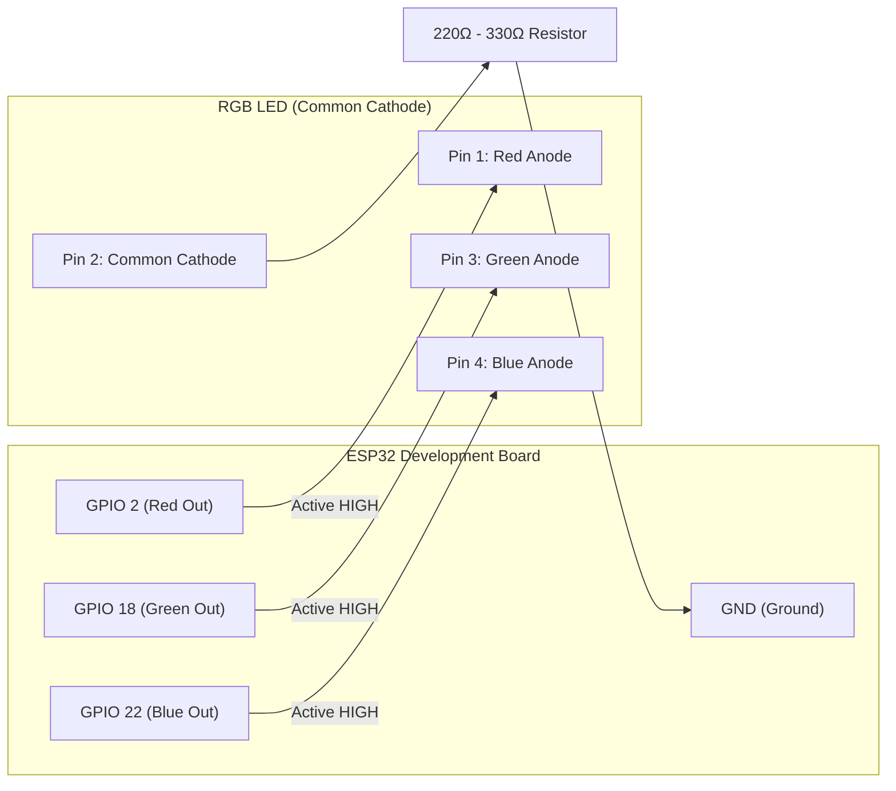
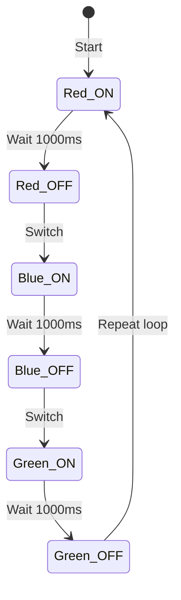

# ESP32 Common Cathode RGB LED Controller

An embedded C firmware project developed for the **ESP32** microcontroller using **PlatformIO** and the native **ESP-IDF (Espressif IoT Development Framework)**. The application sequentially cycles through Red, Blue, and Green colors using an RGB LED with a common cathode configuration and a single current-limiting resistor.

---

## Features

- **Native ESP-IDF GPIO Driver**: Direct hardware register abstraction using `driver/gpio.h`.
- **FreeRTOS Task Scheduling**: Uses `vTaskDelay` with tick-accurate timing (`pdMS_TO_TICKS`) to avoid busy-waiting and yield execution to the FreeRTOS idle task.
- **Optimized Single-Resistor Design**: Uses a single resistor between the shared cathode and ground, suitable for single-channel sequential illumination.

---

## Pin Mapping & Wiring

### Common Cathode RGB LED Pinout Reference

A standard 4-pin common cathode RGB LED typically has the following pin arrangement (looking with the longest lead as pin 2):

```
       _____
     /       \
    |  RGB    |
    |  LED    |
     \_______/
      | | | |
      | | | |
      1 2 3 4
      | | | |
      | | |  \--> Pin 4: Blue Anode
      | |  \----> Pin 3: Green Anode
      |  \------> Pin 2: Common Cathode (Longest pin)
       \--------> Pin 1: Red Anode
```

### Connection Table

| ESP32 Pin | GPIO | Wire Color (suggested) | Connection / Target | Function |
| :--- | :--- | :--- | :--- | :--- |
| **D2** | `GPIO_NUM_2` | Red | RGB LED Pin 1 (Red Anode) | Red Channel Control |
| **D18** | `GPIO_NUM_18` | Green | RGB LED Pin 3 (Green Anode) | Green Channel Control |
| **D22** | `GPIO_NUM_22` | Blue | RGB LED Pin 4 (Blue Anode) | Blue Channel Control |
| **GND** | `GND` | Black | One end of Current-Limiting Resistor | Ground Return |
| — | — | — | Resistor other end to Pin 2 (Cathode) | Current Limiting (~220&Omega;–330&Omega;) |

---

## Circuit Diagram

### Schematic Diagram (ASCII)

```
                       ESP32 Dev Board
                     +-----------------+
                     |                 |
                     |          GPIO 2 |------------[ Red Anode: Pin 1 ]---+
                     |                 |                                   |
                     |         GPIO 18 |------------[ Green Anode: Pin 3 ]-+
                     |                 |                                   |  Common Cathode
                     |         GPIO 22 |------------[ Blue Anode: Pin 4 ]--+     RGB LED
                     |                 |                                   |
                     |             GND |----+                              |
                     +-----------------+    |                              |
                                            |   220 - 330 Ohm              |
                                            +------/\/\/\/\-----[ Cathode: Pin 2 ]
                                                  Resistor
```

### Signal & Wiring Flowchart (Mermaid)



---

## Hardware Design Note: Single Cathode Resistor

In this configuration, a **single resistor** is shared on the cathode return line:

- **Why it works well here**: The firmware activates only one color channel at any given instant ($1\text{ s Red} \to 1\text{ s Blue} \to 1\text{ s Green}$). Because only one LED die conducts current at a time, the forward voltage drop across the resistor remains stable and consistent.
- **Multi-color note**: If you later upgrade the firmware to mix colors (e.g., lighting Red + Blue simultaneously to create purple), individual current-limiting resistors on each anode (Pins 1, 3, 4) are recommended instead. This prevents current sharing and brightness variations caused by differences in forward voltage ($V_{f,\text{red}} \approx 2.0\text{V}$ vs. $V_{f,\text{green/blue}} \approx 3.2\text{V}$).

---

## Firmware Behavior & Timing

The application loop executes the following sequence indefinitely:



1. **Red LED ON** $\to$ Delay 1000 ms $\to$ **Red LED OFF**
2. **Blue LED ON** $\to$ Delay 1000 ms $\to$ **Blue LED OFF**
3. **Green LED ON** $\to$ Delay 1000 ms $\to$ **Green LED OFF**

---

## Project Structure

```text
LED_Controller/
├── .gitignore               # Ignored build artifacts and IDE cache
├── CMakeLists.txt           # Root ESP-IDF CMake project definition
├── platformio.ini           # PlatformIO environment configuration
├── include/                 # Header files
├── lib/                     # Custom private libraries (if any)
├── src/
│   ├── CMakeLists.txt       # Component registration (SRCS main.c)
│   └── main.c               # Firmware source code
└── README.md                # Project documentation & circuit diagram
```

---

## Getting Started

### Prerequisites

- [VS Code](https://code.visualstudio.com/) with the [PlatformIO IDE Extension](https://platformio.org/install/ide?install=vscode), **OR**
- [PlatformIO Core (CLI)](https://docs.platformio.org/en/latest/core/installation/index.html)

### Build and Flash

1. **Clone the repository**:
   ```bash
   git clone https://github.com/<your-username>/LED_Controller.git
   cd LED_Controller
   ```

2. **Connect the ESP32**:
   Plug your ESP32 board into your computer via a Micro-USB data cable.

3. **Build the project**:
   - **PlatformIO CLI**:
     ```bash
     pio run
     ```
   - **VS Code**: Click the **Build** checkmark icon ($\checkmark$) in the PlatformIO bottom toolbar.

4. **Upload to ESP32**:
   - **PlatformIO CLI**:
     ```bash
     pio run -t upload
     ```
   - **VS Code**: Click the **Upload** right-arrow icon ($\rightarrow$) in the PlatformIO toolbar.

5. **Open Serial Monitor** *(optional)*:
   ```bash
   pio device monitor
   ```

---

## Configuration (`platformio.ini`)

The project uses the `espidf` framework targeting the `esp32dev` board:

```ini
[env:esp32dev]
platform = espressif32
board = esp32dev
framework = espidf
```

---

## Future Enhancements

- **PWM Dimming / LEDC**: Utilize ESP-IDF's `driver/ledc.h` to implement smooth color transitions and full RGB palette mixing (16 million colors).
- **Wi-Fi / BLE Control**: Add a lightweight HTTP/WebSocket web server to toggle colors and effects from a smartphone or browser.
- **Capacitive Touch / Button Input**: Add physical input triggers using ESP32 touch pins or tactile switches.

---

## License

This project is licensed under the [MIT License](LICENSE) - feel free to use and modify it for your DIY and educational projects.

