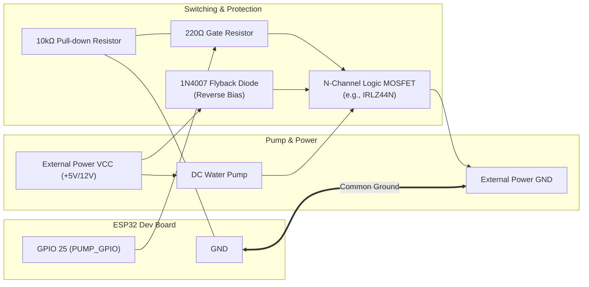
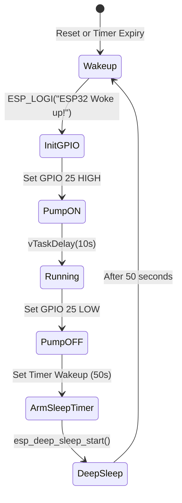

# 🌱 ESP32 Automated Plant Watering System

An automated, ultra-low-power plant watering controller built using **ESP-IDF** and **PlatformIO** on the **ESP32**. The controller wakes up at set intervals, activates a submersible DC pump or solenoid valve for a calibrated duration, and goes back to deep sleep to conserve battery.

---

## 📑 Table of Contents
- [Features](#-features)
- [Hardware Requirements](#-hardware-requirements)
- [Pinout Configuration](#-pinout-configuration)
- [Circuit Diagrams](#-circuit-diagrams)
  - [Option A: Logic-Level N-Channel MOSFET (Recommended)](#option-a-logic-level-n-channel-mosfet-recommended)
  - [Option B: 5V / 3.3V Relay Module](#option-b-5v--33v-relay-module)
- [How It Works](#-how-it-works)
- [⚠️ Code & Hardware Gotchas (Read Before Powering On)](#️-code--hardware-gotchas)
- [Build and Flash](#-build-and-flash)
- [Configuration & Customization](#-configuration--customization)

---

## ⚡ Features
- **Deep Sleep Cycling**: Minimizes power consumption by shutting down the CPU, high-speed clocks, and Wi-Fi/BT peripherals between watering cycles.
- **Configurable Timing**: Independent configuration for watering duration and sleep intervals.
- **ESP-IDF Native**: Clean C implementation utilizing FreeRTOS delay primitives and ESP32 power management drivers.

---

## 🛠 Hardware Requirements

| Component | Recommended Specification | Purpose |
| :--- | :--- | :--- |
| **Microcontroller** | ESP32 DevKit V1 (30 or 38 pin) | System controller |
| **Water Pump** | 3V–6V Mini Submersible DC Pump (or 12V with suitable supply) | Fluid delivery |
| **Switching Element** | Logic-Level N-MOSFET (e.g., **IRLZ44N**, **AO3400**) or 3.3V/5V Relay Module | Isolates high pump current from ESP32 GPIO |
| **Flyback Diode** | **1N4007** (or 1N5819 Schottky) | Protects circuitry from motor inductive kickback |
| **Resistors** | 1× 10kΩ (pull-down), 1× 220Ω–1kΩ (gate resistor) | Gate stabilization and current limiting |
| **Power Supply** | 5V 2A USB power adapter or external battery pack | ESP32 and pump power |
| **Tubing & Reservoir** | 6mm silicone tubing & water tank | Plumbing |

---

## 📌 Pinout Configuration

| ESP32 Pin | Function | Connects To |
| :--- | :--- | :--- |
| **GPIO 25** | Pump Control Signal (`PUMP_GPIO`) | MOSFET Gate (via 220Ω resistor) / Relay `IN` |
| **GND** | Ground Reference | Common System Ground (ESP32 GND + Pump Power GND + MOSFET Source) |
| **5V / VIN** | Board Power | 5V Power Source |

---

## 🔌 Circuit Diagrams

### Option A: Logic-Level N-Channel MOSFET (Recommended)

Using a logic-level MOSFET provides silent, reliable, and solid-state switching without mechanical wear.

```
       +5V / External Pump VCC
                 |
                 +-----------------------+
                 |                       |
             +---+---+                   |
             |  DC   |                 [---] Flyback Diode (1N4007)
             | PUMP  |                 | / | (Cathode/band to +VCC,
             +---+---+                 +---+  Anode to Drain)
                 |                       |
                 +-----------+-----------+
                             |
                           Drain (D)
                      ||---+
  ESP32 GPIO 25 ---[ 220Ω ]---|<-  N-MOSFET (e.g. IRLZ44N)
                      ||---+
                        |  Source (S)
                        +-----------+
                        |           |
                     [ 10kΩ ]       |
                    Pull-Down       |
                        |           |
  ESP32 GND ------------+-----------+---- Common Power Supply GND
```

#### Detailed Connection Flowchart:


---

### Option B: 5V / 3.3V Relay Module

If using an off-the-shelf relay board:

```
  ESP32                     Relay Module
+----------+              +-----------------+
|  GPIO 25 |------------->| IN              |
|  GND     |------------->| GND             |
|  5V/VIN  |------------->| VCC (5V)        |
+----------+              +-----------------+
                                 |  NO  (Normally Open) ----> Pump (+) Terminal
                           COM  -+  COM (Common)        ----> +5V External Supply
                           
* Pump (-) connects directly to External Supply GND.
```

---

## 🧠 How It Works

The firmware executes a single-cycle loop utilizing ESP32 Deep Sleep:



1. **Wakeup**: ESP32 boots up from deep sleep (`app_main` is executed like a clean reset).
2. **Configuration**: Pin `GPIO 25` is reset and configured as `GPIO_MODE_OUTPUT`.
3. **Pumping**: Pin `GPIO 25` goes `HIGH`, activating the pump for `PUMP_RUN_TIME_MS` (10 seconds).
4. **Shutdown**: Pin `GPIO 25` goes `LOW`, stopping the pump.
5. **Deep Sleep**: Timer wakeup is set for `SLEEP_TIME_US` (50 seconds) via `esp_sleep_enable_timer_wakeup()`, and `esp_deep_sleep_start()` halts the main cores.

---

## ⚠️ Code & Hardware Gotchas

Pay close attention to these common pitfalls when working with this codebase and hardware setup:

### 1. Code Comment vs. Macro Definition Discrepancy
- **The Issue**: Line 18 in `src/main.c` states:
  ```c
  // 1. Reset and configure GPIO 18 as output
  ```
  However, line 8 defines:
  ```c
  #define PUMP_GPIO GPIO_NUM_25
  ```
- **Gotcha**: If you wire your MOSFET or relay to **GPIO 18** based on the comment, the pump will never trigger. Always follow the macro definition (`GPIO 25`) or update the comment and pin definition to match your physical wiring.

---

### 2. Floating Pin During Deep Sleep (Spurious Watering)
- **The Issue**: When the ESP32 enters deep sleep (`esp_deep_sleep_start()`), standard digital I/O pads enter a high-impedance (floating) state by default.
- **Gotcha**: A floating MOSFET gate can pick up stray electrostatic noise and partially switch ON, causing the pump to run uncontrollably while sleeping or deplete the reservoir.
- **Fix**: 
  - **Hardware**: Always place a **10kΩ pull-down resistor** between the MOSFET Gate and GND.
  - **Software**: If you require pin states to hold during sleep, you can use RTC GPIO hold functionality:
    ```c
    #include "driver/rtc_io.h"
    // ...
    rtc_gpio_hold_en(PUMP_GPIO);
    ```

---

### 3. Active-LOW vs. Active-HIGH Relays (Inverted Logic)
- **The Issue**: Most hobbyist 5V/3.3V relay boards are **Active-LOW** (they turn ON when `IN` is pulled to `0V`/`GND`, and turn OFF when `IN` is at `3.3V`/`5V`).
- **Gotcha**: If an active-LOW relay is used with the current code:
  - `gpio_set_level(PUMP_GPIO, 1)` turns the pump **OFF**.
  - `gpio_set_level(PUMP_GPIO, 0)` turns the pump **ON**.
  - During deep sleep, the floating pin or 0V state may leave the pump running for the entire 50-second sleep period, flooding the plant!
- **Fix**: Use an N-channel MOSFET circuit (which is naturally Active-HIGH), or invert the logic in code if using an active-LOW relay:
  ```c
  #define RELAY_ON   0
  #define RELAY_OFF  1
  ```

---

### 4. Direct GPIO Current Limits & Flyback Voltage
- **The Issue**: An ESP32 GPIO pin can safely source only **12 mA to 20 mA** (40 mA absolute max rating). Even small 5V DC submersible pumps draw **150 mA to 500 mA** under load and up to **1 A** peak stall current.
- **Gotcha**:
  - **Never connect a motor directly to an ESP32 GPIO pin**; doing so will immediately damage the output driver or permanently destroy the chip.
  - When a motor turns off, its magnetic field collapses, generating a high-voltage reverse inductive spike ("back-EMF"). Without a **flyback diode** in reverse-parallel across the motor terminals, this spike can puncture the MOSFET or reset the MCU.

---

### 5. Brownout Resets During Motor Start
- **The Issue**: When the DC pump kicks on, the initial inrush current causes a sudden voltage drop on the power supply rail.
- **Gotcha**: The ESP32 brownout detector triggers at ~2.8V. A voltage dip causes an immediate `Brownout detector was triggered` reboot, creating an infinite reset loop right when the pump starts.
- **Fix**:
  - Do not power the pump directly from the ESP32's `3.3V` pin.
  - Use a separate power supply for the pump, or place a **470 µF – 1000 µF electrolytic capacitor** across the pump's power rails.
  - Ensure the external power source shares a **common ground (GND)** with the ESP32.

---

### 6. RAM Loss Across Deep Sleep Cycles
- **The Issue**: Deep sleep powers down internal SRAM. All standard global or local variables reset to their initial values upon every wakeup.
- **Gotcha**: If you attempt to count watering cycles with a standard counter like `int cycle_count = 0;`, it will always read `0` on each boot.
- **Fix**: Store persistent variables in RTC Slow Memory:
  ```c
  RTC_DATA_ATTR static int cycle_count = 0;
  ```

---

### 7. 64-bit Integer Overflow in Long Sleep Calculations
- **The Issue**: The code uses:
  ```c
  #define SLEEP_TIME_US (50ULL * 1000000ULL)
  ```
- **Gotcha**: The `ULL` (unsigned long long) suffix is critical. If written as `(50 * 1000000)`, 32-bit signed integer arithmetic is used. While 50 seconds fits in 32 bits, increasing sleep intervals to hours (e.g. 12 hours = `43,200,000,000` µs) will overflow a 32-bit integer (`INT32_MAX` is ~`2,147,483,647` µs / ~35.7 minutes), causing unpredictable sleep durations or immediate wakeups. Keep the `ULL` suffix!

---

## 🚀 Build and Flash

This project uses the **ESP-IDF** framework within **PlatformIO**.

### Prerequisites
- [VS Code](https://code.visualstudio.com/) with the [PlatformIO IDE Extension](https://platformio.org/install/ide?install=vscode), OR
- [PlatformIO Core (CLI)](https://docs.platformio.org/en/latest/core/index.html)

### Using PlatformIO CLI

1. **Build the firmware**:
   ```bash
   pio run
   ```

2. **Upload to ESP32**:
   ```bash
   pio run -t upload
   ```

3. **Open Serial Monitor**:
   ```bash
   pio device monitor
   ```
   *(Baud rate is configured to `115200` in `platformio.ini`)*

---

## ⚙️ Configuration & Customization

Edit constants at the top of [`src/main.c`](file:///c:/Users/gaura/DIY/Plant_Watering_System/src/main.c):

```c
// Output GPIO pin wired to MOSFET Gate or Relay IN
#define PUMP_GPIO             GPIO_NUM_25

// Duration the pump stays active each cycle (in milliseconds)
#define PUMP_RUN_TIME_MS      10000                     // 10 seconds

// Sleep duration between watering cycles (in microseconds, use ULL)
// Example for 6 hours: (6ULL * 3600ULL * 1000000ULL)
#define SLEEP_TIME_US         (50ULL * 1000000ULL)      // 50 seconds
```
